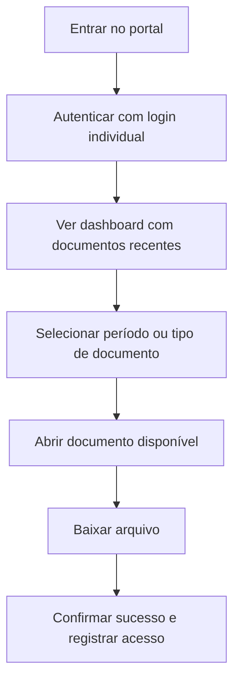
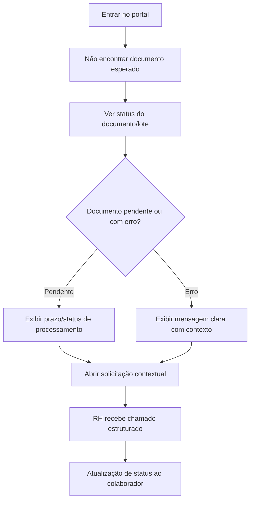
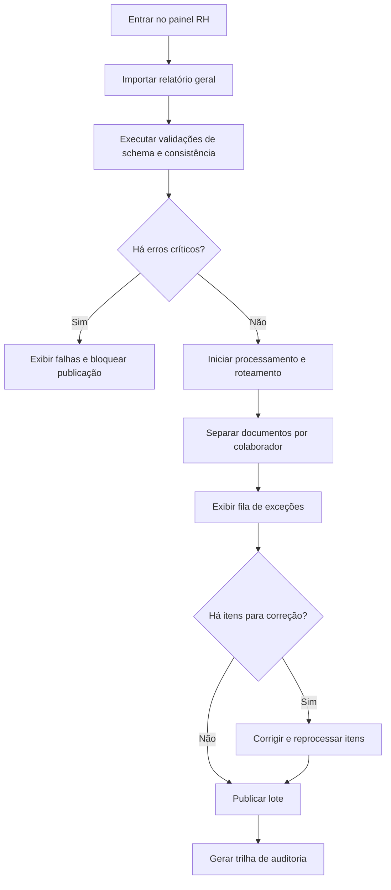

---
stepsCompleted:
  - step-01-init
  - step-02-discovery
  - step-03-core-experience
  - step-04-emotional-response
  - step-05-inspiration
  - step-06-design-system
  - step-07-defining-experience
  - step-08-visual-foundation
  - step-09-design-directions
  - step-10-user-journeys
  - step-11-component-strategy
  - step-12-ux-patterns
  - step-13-responsive-accessibility
  - step-14-complete
lastStep: 14
inputDocuments:
  - _bmad-output/planning-artifacts/product-brief-SISTEMA ADALTO.md
  - _bmad-output/planning-artifacts/prd.md
---

# UX Design Specification SISTEMA ADALTO

**Author:** HIMMLER
**Date:** 2026-04-08

---

<!-- UX design content will be appended sequentially through collaborative workflow steps -->

## Resumo Executivo

### Visão do Projeto

O SISTEMA ADALTO é uma plataforma web B2B para gestão documental do colaborador, com foco em resolver uma dor operacional muito específica de RH/DP: distribuir holerites e cartões de ponto com segurança, rapidez e rastreabilidade. A UX precisa sustentar duas experiências principais ao mesmo tempo: o portal de autosserviço do colaborador e o painel administrativo do RH.

O valor central do produto está em transformar um processo manual e sujeito a erro em um fluxo previsível, claro e confiável. Para o colaborador, isso significa acesso simples aos próprios documentos. Para o RH, isso significa menos retrabalho, menos risco de envio incorreto e menos dependência de conferência manual em períodos críticos.

### Usuários-Alvo

O usuário primário é o colaborador, que precisa acessar seus documentos de trabalho de forma autônoma e sem fricção. Esse usuário quer localizar rapidamente o documento certo, entender seu status e fazer download sem precisar acionar o RH.

O segundo grupo central é o RH/DP operacional, responsável por importar relatórios gerais, processar lotes, corrigir exceções e publicar documentos. Também existem usuários de apoio com fronteiras bem distintas: o gestor do cliente acompanha status funcional do envio e abre chamado técnico quando necessário, enquanto admin e suporte interno da Mercavejo fazem diagnóstico, auditoria e observabilidade.

### Principais Desafios de Design

O primeiro desafio é desenhar duas jornadas muito diferentes sem fragmentar a experiência: uma voltada à simplicidade extrema para o colaborador e outra voltada ao controle operacional para o RH.

O segundo desafio é tornar visível o que normalmente é invisível no backstage. O sistema precisa comunicar status, pendências, exceções e progresso de forma compreensível, sem sobrecarregar o usuário com jargão técnico.

O terceiro desafio é preservar confiança em um produto que lida com dados sensíveis. Isso exige decisões claras de hierarquia visual, autorização, segregação de acesso e feedback de erro muito bem resolvido.

### Oportunidades de Design

Há uma oportunidade forte de criar uma experiência baseada em clareza e previsibilidade, com navegação curta, status explícitos e pontos de decisão mínimos para o colaborador.

No painel administrativo, a melhor oportunidade está em priorizar uma lógica orientada a exceções: mostrar o que falhou, por que falhou e o que fazer a seguir. Isso reduz o custo cognitivo do RH e acelera a operação.

Também existe espaço para uma UX de confiança, com trilha de auditoria percebida, mensagens objetivas e estados consistentes que reforcem a credibilidade do sistema em momentos de fechamento de folha e ponto.

## Core User Experience

### Definindo a Experiência

A experiência central do SISTEMA ADALTO é permitir que o colaborador encontre, entenda e baixe seus documentos de trabalho com o mínimo de passos possível, enquanto o RH consegue importar, separar, validar e publicar grandes lotes com controle e rastreabilidade. O núcleo do produto está em transformar um fluxo tradicionalmente manual em uma operação previsível e quase automática.

O uso mais frequente e crítico é a consulta de documentos pelo colaborador, especialmente holerite e cartão de ponto. Se essa ação for simples, segura e direta, o valor do produto fica evidente para a base de usuários. Em paralelo, o fluxo administrativo precisa ser robusto o suficiente para eliminar conferências repetitivas e reduzir erros de roteamento.

### Estratégia de Plataforma

O produto deve ser uma plataforma web acessível em desktop e navegadores corporativos, com comportamento responsivo para uso ocasional em dispositivos móveis, mas sem depender de app nativo no MVP. A experiência principal vai ocorrer com mouse e teclado, já que o contexto de uso é corporativo.

A prioridade é compatibilidade com ambientes de trabalho comuns, leitura clara em telas médias e grandes, e fluxos que não exijam treino longo. Não há necessidade de funcionalidade offline no escopo inicial. O sistema deve enfatizar login seguro, navegação direta, carregamento rápido de listas e downloads confiáveis.

### Interações sem Esforço

O que deve parecer imediato é a identificação do documento certo, a leitura do seu status e o acesso ao download. O colaborador não pode precisar decifrar nomenclatura técnica ou percorrer várias camadas de navegação para concluir a tarefa.

No lado do RH, deve ser natural importar um lote, ver validações, entender exceções e identificar rapidamente o que precisa de correção. O sistema deve assumir o máximo possível do trabalho repetitivo, deixando visíveis apenas os casos que exigem decisão humana.

### Momentos Críticos de Sucesso

O momento em que o colaborador percebe que o sistema é melhor acontece quando ele acessa o portal, encontra o documento correto em poucos segundos e faz o download sem depender do RH. Esse é o ponto em que o produto deixa de ser apenas um portal e passa a ser o canal oficial.

O momento crítico de falha é a publicação incorreta ou incompleta de documentos, porque isso afeta confiança, operação e percepção de segurança. No RH, o sucesso se consolida quando o time consegue processar um lote com poucas intervenções manuais e com evidências claras do que foi publicado, do que falhou e do que foi corrigido.

### Princípios de Experiência

1. Acesso direto ao documento certo deve ter o menor número possível de passos.
2. O sistema deve sempre deixar claro o status do documento, do lote e da ação seguinte.
3. A operação do RH deve ser orientada por exceções, não por conferência manual em massa.
4. A confiança do usuário deve vir de clareza visual, consistência e rastreabilidade explícita.

## Desired Emotional Response

### Objetivos Emocionais Primários

O SISTEMA ADALTO deve transmitir confiança, controle e alívio. O colaborador precisa sentir que o acesso aos próprios documentos é simples, seguro e sem fricção. O RH precisa sentir que a operação é previsível, rastreável e muito menos sujeita a erro.

### Mapeamento da Jornada Emocional

Na primeira descoberta, o usuário deve sentir clareza e segurança sobre onde está e o que pode fazer. Durante o uso principal, a emoção desejada é tranquilidade, com a sensação de que o sistema conduz a tarefa sem exigir esforço cognitivo excessivo.

Ao concluir a tarefa, o colaborador deve sentir autonomia e satisfação por resolver algo que antes dependia do RH. Se algo der errado, o sistema deve reduzir ansiedade com mensagens claras, status explícitos e próximos passos objetivos.

### Micro-Emoções

As micro-emocoes mais importantes são confiança versus desconfiança, clareza versus confusão, autonomia versus dependência e calma versus ansiedade. Para o RH, também importa a sensação de previsibilidade, porque ela reduz estresse em períodos críticos de fechamento.

### Implicações de Design

Para gerar confiança, a interface precisa ser consistente, simples e com feedback inequívoco de sucesso, erro e pendência. Para gerar controle, os estados do sistema devem ser visíveis e fáceis de interpretar.

Para reduzir ansiedade, as mensagens de erro não podem ser genéricas; precisam explicar o que aconteceu e o que o usuário deve fazer em seguida. Para reforçar alívio, o fluxo do colaborador deve ser curto, direto e sem ruído visual desnecessário.

### Princípios de Design Emocional

1. Reduzir incerteza em cada etapa do fluxo.
2. Fazer o usuário sentir que está no controle, mesmo quando o sistema automatiza a maior parte do trabalho.
3. Comunicar status e resultado com linguagem objetiva e sem ambiguidade.
4. Evitar sobrecarga cognitiva em momentos de pressão operacional.

## UX Pattern Analysis & Inspiration

### Inspiring Products Analysis

**WhatsApp**
Resolve comunicação rápida com um modelo mental muito simples: lista, status e conversa. Funciona bem porque reduz decisões, mostra claramente o que é novo e mantém o foco no que importa. Para o SISTEMA ADALTO, é uma boa referência de simplicidade operacional, feedback claro e fluxo direto para a ação principal.

**Google Drive**
Resolve organização e acesso a arquivos com hierarquia visual limpa, busca eficiente e sensação de controle sobre documentos. É especialmente relevante para um portal documental porque ajuda a pensar em listagem por contexto, organização por período e confiança no acesso ao arquivo certo.

**Nubank**
Resolve tarefas financeiras com interface limpa, hierarquia forte e comunicação objetiva de estados. É uma referência útil para transmitir confiança, reduzir ansiedade e deixar claro o que aconteceu depois de cada ação, especialmente em ambientes com dados sensíveis.

### Transferable UX Patterns

**Navigation Patterns**
- Lista principal com status visível - pode funcionar para o colaborador localizar documentos rapidamente.
- Estrutura por contexto e período - útil para organizar holerites e cartões de ponto sem sobrecarregar a interface.
- Hierarquia visual forte - ajuda o usuário a identificar a ação principal sem esforço.

**Interaction Patterns**
- Feedback imediato de sucesso, pendência ou erro - excelente para o fluxo de download e importação.
- Ação principal sempre evidente - reduz ambiguidade no portal do colaborador e no painel do RH.
- Estados claros e persistentes - útil para mostrar processamento, publicação e exceções.

**Visual Patterns**
- Layout limpo com baixa densidade de ruído - suporta o objetivo emocional de calma e controle.
- Uso forte de tipografia e contraste - melhora leitura em telas corporativas.
- Indicadores de status simples e consistentes - reforçam confiança em tarefas sensíveis.

### Anti-Patterns to Avoid

- Listas confusas sem indicação clara de status - isso aumenta frustração e dúvidas sobre onde está o documento.
- Excesso de informação técnica na interface - isso quebra a simplicidade necessária para o colaborador.
- Fluxos longos com muitas decisões antes do acesso ao documento - isso enfraquece o valor do autosserviço.
- Mensagens genéricas de erro - isso aumenta ansiedade e reduz confiança na plataforma.
- Painéis administrativos que parecem planilhas complexas - isso dificulta leitura rápida e ação orientada a exceções.

### Design Inspiration Strategy

**What to Adopt**
- Clareza de status e baixa fricção do WhatsApp - porque o colaborador precisa chegar ao documento certo sem pensar demais.
- Organização visual do Google Drive - porque o produto lida com documentos e precisa transmitir controle.
- Hierarquia limpa e confiança visual do Nubank - porque o sistema opera com dados sensíveis e precisa parecer seguro.

**What to Adapt**
- Listas e navegação por contexto - adaptar para período, tipo de documento e status, em vez de conversa ou pasta genérica.
- Feedback visual de ação - simplificar para uso corporativo, mantendo objetividade e sem elementos desnecessários.
- Estados persistentes de carga e processamento - ajustar para o fluxo de lote do RH.

**What to Avoid**
- Estruturas excessivamente densas ou “dashboard pesado” - conflitam com o objetivo de simplicidade.
- Navegação fragmentada demais - aumenta a carga cognitiva e atrasa o acesso ao documento.
- Visual poluído ou técnico demais - enfraquece confiança e compreensão.

## Design System Foundation

### 1.1 Design System Choice

O SISTEMA ADALTO deve usar um design system themeable baseado em MUI, com personalização visual própria sobre componentes maduros e acessíveis. Essa abordagem equilibra velocidade de desenvolvimento, consistência de interface e flexibilidade para adaptar o produto ao contexto corporativo e sensível do domínio de RH.

### Rationale for Selection

O projeto precisa de uma base confiável e rápida de implementar, sem abrir mão de clareza visual e acessibilidade. MUI oferece componentes de qualidade, boa cobertura de casos de uso corporativos e uma fundação adequada para construir tanto o portal do colaborador quanto o painel administrativo.

A solução também ajuda a manter consistência entre telas, reduz retrabalho de UI e favorece um produto com aparência profissional desde o MVP. Como o sistema lida com dados sensíveis e fluxos operacionais críticos, a previsibilidade do design system é mais valiosa do que uma identidade visual totalmente artesanal.

### Implementation Approach

A implementação deve partir dos componentes base do MUI, criando uma camada de tema própria com tokens para cor, tipografia, espaçamento, estados e densidade visual. Os componentes devem ser organizados por padrões de uso do produto, como listas documentais, status, filtros, painéis de lote e feedback de processamento.

No MVP, a prioridade é padronizar os fluxos mais recorrentes e garantir consistência entre o portal do colaborador e o painel do RH. Componentes realmente específicos podem ser criados sob medida apenas quando os padrões nativos não atenderem bem ao contexto.

### Customization Strategy

A personalização deve reforçar três atributos principais: confiança, legibilidade e objetividade. Isso inclui uma paleta visual contida, contrastes fortes para estados e ações, tipografia clara e layouts com baixa poluição visual.

O sistema deve evitar excesso decorativo e manter uma linguagem funcional, alinhada ao caráter operacional do produto. A customização também precisa contemplar estados vazios, carregamento, erro e sucesso com bastante rigor, porque esses momentos são centrais para a percepção de confiabilidade.

## 2. Core User Experience

### 2.1 Defining Experience

A experiência definidora do SISTEMA ADALTO é permitir que o colaborador acesse o documento certo imediatamente após entrar no portal, sem precisar pensar em onde procurar, enquanto o cliente transforma um lote bruto em publicações individuais confiáveis com poucos passos. Se o sistema fizer isso de forma simples e previsível, ele entrega o valor principal do produto. Diagnóstico profundo, auditoria e indicadores ficam em uma camada admin separada da experiência do gestor.

O que o usuário descreveria para outra pessoa é que consegue entrar, ver o que precisa e baixar o holerite ou cartão de ponto em segundos, sem depender do RH. No lado administrativo, a percepção de sucesso é importar, validar e publicar com segurança, sabendo exatamente o que aconteceu em cada etapa.

### 2.2 User Mental Model

O colaborador chega com um mental model muito simples: ele quer “meus documentos” e espera encontrar uma lista clara por período ou tipo. Ele não pensa em pipeline, lote ou roteamento; pensa apenas em acesso rápido e confiável.

O RH, por sua vez, enxerga o problema como uma operação de conferência e distribuição. O que ele deseja é colocar o arquivo certo no lugar certo, identificar exceções rapidamente e evitar retrabalho. As maiores frustrações tendem a surgir quando o status do documento não está claro ou quando o sistema exige muitas decisões antes de concluir a tarefa.

### 2.3 Success Criteria

O sucesso acontece quando o usuário sente que “isso simplesmente funciona”. O colaborador sabe que está no lugar certo porque vê status claros, lista organizada e ação de download evidente. O RH percebe sucesso quando o lote avança com pouca intervenção manual e a fila de exceções deixa explícito o que precisa ser corrigido.

Os indicadores centrais são: acesso rápido ao documento correto, entendimento claro do status, baixa fricção no download e visualização objetiva de progresso, pendências e conclusão do lote.

### 2.4 Novel UX Patterns

O sistema não precisa inventar um novo padrão de interação. Ele deve combinar padrões conhecidos de portal documental, lista com status e painel operacional orientado a exceções, mas com uma execução mais limpa e mais confiável do que a maioria dos sistemas corporativos.

A diferença está em integrar essas camadas de forma coesa: o colaborador recebe simplicidade quase de app de consumo, enquanto o RH recebe densidade operacional controlada sem parecer uma planilha pesada.

### 2.5 Experience Mechanics

**1. Iniciação:** o colaborador entra com autenticação individual e cai em um dashboard com seus documentos recentes, status e chamadas principais. O RH entra em um painel que destaca lotes, pendências e ações necessárias.

**2. Interação:** o colaborador filtra por período ou tipo, abre o documento e baixa o arquivo. O RH importa o lote, visualiza validações, acompanha o processamento e revisa exceções.

**3. Feedback:** a interface responde com estados claros de carregamento, sucesso, pendência, indisponibilidade ou erro. Cada status precisa indicar o próximo passo sem exigir interpretação ambígua.

**4. Conclusão:** o colaborador termina ao baixar o documento ou registrar uma solicitação contextual. O RH conclui quando o lote é publicado com trilha de auditoria e as exceções restantes ficam claramente priorizadas.

## Visual Design Foundation

### Color System

O SISTEMA ADALTO deve usar uma paleta corporativa contida, com sensação de confiança, clareza e controle. A direção recomendada é uma base escura e estável para elementos estruturais, combinada com superfícies claras e acentos discretos para ações e estados.

Sugestão de orientação cromática:
- Base primária: azul-marinho profundo ou slate escuro, para transmitir confiabilidade.
- Superfícies: branco e cinzas muito claros, para preservar legibilidade e reduzir ruído.
- Ação primária: teal ou azul-energia contido, para diferenciar ações sem agressividade visual.
- Estados de sucesso: verde moderado.
- Estados de atenção: âmbar.
- Estados de erro: vermelho controlado, com uso restrito.

A paleta deve priorizar semântica clara em vez de ornamento. O sistema precisa garantir contraste adequado em todas as combinações relevantes, especialmente em listas, badges de status e mensagens de feedback.

### Typography System

A tipografia deve transmitir profissionalismo, legibilidade e precisão. A recomendação é usar uma família sans-serif moderna com boa leitura em interface corporativa, evitando aparência genérica demais.

Sugestão de abordagem:
- Fonte principal: IBM Plex Sans ou equivalente com caráter técnico-profissional.
- Fonte secundária/monoespaçada: IBM Plex Mono ou equivalente para IDs, códigos, lotes e dados tabulares quando necessário.
- Hierarquia forte com títulos curtos e corpo confortável.
- Altura de linha generosa o suficiente para leitura rápida em telas corporativas.
- Peso tipográfico usado para criar hierarquia, não enfeite.

A tipografia precisa suportar muito texto funcional, status e estruturas em lista sem perder clareza. O foco é leitura rápida, não expressão editorial.

### Spacing & Layout Foundation

O layout deve ser eficiente, organizado e previsível, com densidade moderada. O sistema pode usar grid de 12 colunas em telas maiores, mantendo comportamento responsivo em telas menores.

Direção recomendada:
- Base de espaçamento em múltiplos de 8px.
- Margens e paddings consistentes para reduzir variação visual.
- Listas e painéis com respiro suficiente para leitura, mas sem desperdício de espaço.
- Estrutura de páginas voltada para scanning rápido.
- Uso claro de seções, cards e áreas de detalhe para separar lista, status e ações.

O portal do colaborador deve parecer simples e direto. O painel administrativo pode ter densidade um pouco maior, mas sem virar uma interface pesada ou “cara de planilha”.

### Accessibility Considerations

A fundação visual deve atender contraste mínimo compatível com WCAG AA nos fluxos críticos. Isso inclui textos, badges, botões, estados de foco e mensagens de erro.

Também é importante:
- Garantir navegação por teclado em todo o fluxo principal.
- Manter estados de foco visíveis e consistentes.
- Não depender apenas de cor para comunicar status.
- Usar tamanhos de fonte confortáveis para leitura em contexto corporativo.
- Preservar clareza em tabelas, listas e componentes de status.

A acessibilidade aqui não é um extra; ela é parte da confiança do produto, porque o uso principal ocorre em tarefas sensíveis e recorrentes.

## Design Direction Decision

### Design Directions Explored

Exploramos três direções visuais principais para o SISTEMA ADALTO:

- Direção 1 - Portal Claro: foco máximo em simplicidade, navegação direta e baixa densidade visual para o colaborador.
- Direção 2 - Operação Guiada: equilíbrio entre clareza do portal e maior ênfase em estados, exceções e progresso no painel do RH.
- Direção 3 - Confiança Estruturada: abordagem mais institucional, com forte separação entre contexto, status e ação.

### Chosen Direction

A direção escolhida é uma combinação da Direção 1 com elementos da Direção 2, usando a Direção 3 apenas como referência de tom e confiança.

### Design Rationale

Essa combinação funciona melhor porque o produto precisa servir dois contextos diferentes sem perder simplicidade. O colaborador precisa de um fluxo extremamente claro e curto, enquanto o RH precisa enxergar lote, status e exceções sem ruído. A Direção 1 garante a fricção mínima no uso principal, e a Direção 2 adiciona a estrutura operacional necessária para o backstage.

### Implementation Approach

A interface do colaborador deve ser tratada como um portal documental de leitura rápida, com hierarquia simples, alto contraste e poucas ações principais. O painel administrativo deve usar cartões, listas e estados bem definidos para lotes, exceções e publicação, sem aparência de dashboard pesado.

A base visual deve manter a fundação corporativa já definida, com componentes themeable no MUI e variações de densidade por contexto de uso. O resultado precisa ser consistente, confiável e rápido de implementar, sem exagero formal.

## User Journey Flows

### Jornada 1 - Colaborador: Acesso e Download do Documento

O fluxo principal do colaborador começa no login individual, passa pela tela inicial com os documentos recentes e termina no download do holerite ou cartão de ponto. O objetivo é eliminar procura desnecessária e tornar a ação de acesso imediata.

Pontos críticos do fluxo:
- O usuário deve enxergar status e período sem interpretar termos técnicos.
- O download precisa ser imediato e confiável.
- O sucesso precisa ser visível antes de qualquer ação adicional.

### Jornada 2 - Colaborador: Documento Não Encontrado e Contestação Guiada

Quando o documento esperado não aparece, o colaborador precisa entender se o item está em processamento, com falha ou indisponível. O fluxo deve evitar abertura de chamado genérico e encaminhar uma contestação com contexto.

Pontos críticos do fluxo:
- Mensagem de ausência deve ser clara e orientada à ação.
- A solicitação precisa carregar lote, período e documento automaticamente.
- O usuário deve sentir que o sistema “soube o que fazer”.

### Jornada 3 - RH/DP Operador: Importação, Validação e Publicação em Lote

O RH entra com o arquivo geral, executa validações automáticas, acompanha exceções e conclui a publicação no portal. Esse é o fluxo operacional mais crítico do produto.

Pontos críticos do fluxo:
- A validação deve falhar cedo quando houver ambiguidade.
- A fila de exceções precisa deixar claro o que fazer em seguida.
- O sistema deve preservar estado consistente durante reprocessos.

### Journey Patterns

Os fluxos mostram alguns padrões que devem ser consistentes em toda a experiência:

- Navegação por contexto e período, com status sempre visível.
- Feedback explícito de progresso, sucesso e erro.
- Caminho curto para a ação principal, sem etapas redundantes.
- Tratamento orientado a exceções para reduzir esforço manual.

### Flow Optimization Principles

1. Reduzir o número de decisões antes da ação principal.
2. Tornar o status do sistema visível em toda a jornada.
3. Evitar chamadas genéricas quando houver contexto suficiente para automatizar a próxima etapa.
4. Priorizar clareza de recuperação quando algo falhar.

## Component Strategy

### Design System Components

Como a base visual escolhida foi MUI com tema próprio, a maior parte da infraestrutura de UI já pode ser coberta por componentes maduros do design system: AppBar, Drawer, Tabs, Buttons, Cards, Lists, Tables, Chips, Alerts, Dialogs, Menus, Tooltips, Progress, Snackbar, TextField, Select, Date/Range pickers e componentes de layout responsivo.

Esses componentes são suficientes para cobrir navegação, formulários, feedback e estrutura geral das páginas. O ganho está em usar os componentes nativos com consistência e em encaixar tokens de cor, espaçamento e tipografia para manter a experiência coesa.

### Custom Components

#### 1. Document Tile

**Purpose:** Exibir cada holerite ou cartão de ponto de forma escaneável, com status imediato e ação de download clara.
**Usage:** Usado no portal do colaborador e em visões resumidas do RH.
**Anatomy:** título do documento, período, status, metadados resumidos e ação principal.
**States:** disponível, pendente, em processamento, indisponível, erro.
**Variants:** compacto e expandido.
**Accessibility:** rótulo claro para leitor de tela, foco visível e navegação por teclado para abrir ou baixar.
**Content Guidelines:** nomes curtos, período padronizado e status legível.
**Interaction Behavior:** clique abre detalhes; ação secundária baixa o documento diretamente quando disponível.

#### 2. Batch Progress Panel

**Purpose:** Mostrar o avanço da importação e publicação em lote para o RH.
**Usage:** Painel administrativo durante processamento e reprocesso.
**Anatomy:** nome do lote, barra de progresso, contadores de concluídos, falhas e pendências, mensagens de estado.
**States:** inicial, processando, com exceções, concluído, pausado, falha crítica.
**Variants:** resumo compacto e visão detalhada.
**Accessibility:** atualização de progresso anunciada com cuidado e suporte a navegação por teclado nas ações.
**Content Guidelines:** números objetivos e mensagens operacionais curtas.
**Interaction Behavior:** acompanha o lote em tempo quase real e destaca etapas bloqueadas.

#### 3. Exception Queue Item

**Purpose:** Listar exceções de forma orientada à ação, permitindo correção rápida.
**Usage:** Fila de exceções da operação interna/admin Mercavejo.
**Anatomy:** item afetado, causa provável, prioridade, ação recomendada e histórico resumido.
**States:** nova, em análise, em correção, reprocessada, resolvida.
**Variants:** lista densa e cartão detalhado.
**Accessibility:** suporte a leitura sequencial e comandos focados na ação principal.
**Content Guidelines:** descrever causa e ação em linguagem simples.
**Interaction Behavior:** permite abrir detalhes, corrigir e reprocessar sem sair do contexto.

#### 4. Status Timeline

**Purpose:** Exibir a trajetória de um documento ou lote ao longo do processamento e publicação.
**Usage:** Telas de detalhe, auditoria e suporte interno/admin.
**Anatomy:** marcos de evento, horário, status e observação.
**States:** normal, com alerta, com falha, concluído.
**Variants:** versão resumida e completa.
**Accessibility:** estrutura linear, leitura clara por ordem cronológica e labels objetivos.
**Content Guidelines:** eventos curtos e rastreáveis.
**Interaction Behavior:** permite expandir detalhes sem perder o fio da linha do tempo.

### Component Implementation Strategy

A estratégia de implementação deve priorizar os componentes que sustentam os fluxos principais do produto: visualização de documentos, processamento em lote e tratamento de exceções. Componentes nativos do MUI devem ser reutilizados sempre que possível, e os componentes customizados devem ser construídos em cima dos mesmos tokens para evitar inconsistência visual.

A padronização deve incluir estados vazios, loading, sucesso, alerta e erro desde o início, porque esses estados são parte central da confiança do usuário. Toda interação sensível deve ter feedback explícito e rastreabilidade clara.

### Implementation Roadmap

**Phase 1 - Core Components:**

- Document Tile - necessário para o acesso principal do colaborador.
- Batch Progress Panel - necessário para importação e publicação em lote.

**Phase 2 - Supporting Components:**

- Exception Queue Item - necessário para corrigir problemas sem fricção.
- Status Timeline - necessário para auditoria e suporte interno/admin.

**Phase 3 - Enhancement Components:**

- Detalhes avançados de filtros e busca - para acelerar consultas frequentes.
- Resumos executivos de KPI - para fortalecer a governança operacional da Mercavejo, fora da jornada do gestor cliente.

## UX Consistency Patterns

### Button Hierarchy

O SISTEMA ADALTO deve ter uma hierarquia de botões muito clara: uma ação primária por tela, ações secundárias com peso visual menor e ações destrutivas sempre separadas e confirmadas.

**When to Use:** usar botão primário para baixar documento, publicar lote, reprocessar e confirmar ações críticas.
**Visual Design:** primário em cor de ação principal; secundário com contorno ou tratamento neutro; destrutivo em vermelho com uso restrito.
**Behavior:** o botão principal deve ser sempre o primeiro ponto de atenção visual e não pode competir com outras ações.
**Accessibility:** estados de foco claros, rótulos descritivos e contraste WCAG AA.
**Mobile Considerations:** botões em largura total quando necessário para toque confortável.
**Variants:** primary, secondary, tertiary, destructive, loading e disabled.

### Feedback Patterns

Feedback deve ser imediato, explícito e ligado ao contexto da ação. O usuário precisa saber o que aconteceu, o que mudou e qual é o próximo passo.

**When to Use:** sucesso de download, falha de importação, pendência de processamento, reprocessamento e conclusão de lote.
**Visual Design:** alerts e badges sem excesso de cor, usando semântica clara de sucesso, atenção e erro.
**Behavior:** toda resposta do sistema deve indicar resultado e orientação seguinte.
**Accessibility:** mensagens anunciáveis por leitor de tela e não dependentes apenas de cor.
**Mobile Considerations:** feedback em blocos curtos e facilmente descartáveis.
**Variants:** inline, toast/snackbar, banner e status chip.

### Form Patterns

Formulários no SISTEMA ADALTO devem ser curtos, guiados e com validação em linha quando possível. O objetivo é evitar erros antes da submissão e reduzir retrabalho.

**When to Use:** login, upload, cadastro de usuário, filtros e contestação contextual.
**Visual Design:** campos amplos, labels persistentes e ajuda contextual objetiva.
**Behavior:** validação progressiva, mensagens de erro próximas ao campo e prevenção de submissão inválida.
**Accessibility:** associação correta de label, descrição e erro; navegação por teclado completa.
**Mobile Considerations:** campos empilhados e suporte a teclado apropriado.
**Variants:** campo simples, grupo de campos, seletor de período e upload com validação.

### Navigation Patterns

A navegação deve favorecer descoberta rápida sem multiplicar decisões. O colaborador precisa chegar aos documentos em poucos cliques; o gestor cliente precisa transitar entre lotes, histórico e suporte sem perder contexto; a operação admin precisa acessar exceção, auditoria e indicadores em trilhas próprias.

**When to Use:** navegação principal do portal, menu do RH e navegação entre detalhes e listas.
**Visual Design:** estrutura simples com poucas entradas principais e destaque claro para a área ativa.
**Behavior:** manter contexto ao voltar de detalhes para lista e preservar filtros quando fizer sentido.
**Accessibility:** ordem de tab consistente, landmarks semânticos e labels claros.
**Mobile Considerations:** menu colapsável com acesso rápido às ações mais importantes.
**Variants:** top navigation, side navigation e navegação contextual por abas.

### Additional Patterns

**Loading and Empty States:** devem explicar claramente o que está acontecendo ou o que falta fazer, evitando telas vazias sem orientação.

**Search and Filtering:** priorizar busca por período, tipo de documento e status, com filtros visíveis e fáceis de limpar.

**Modal and Overlay Use:** usar modais apenas para confirmação crítica ou detalhe que realmente exija foco; evitar sobreposição desnecessária.

**Design System Integration:** os padrões devem usar tokens do MUI themeado e herdar a mesma linguagem visual do restante da interface.

## Responsive Design & Accessibility

### Responsive Strategy

O SISTEMA ADALTO deve ser pensado mobile-first em termos de estrutura, mas com prioridade real para desktop, já que o uso principal ocorre em ambiente corporativo. No desktop, o portal do colaborador pode usar layout mais direto com lista centralizada e área de detalhe lateral; o painel do RH pode usar visão em múltiplas colunas, desde que a leitura continue clara.

No tablet, a interface deve simplificar a densidade e empilhar áreas secundárias sem perder contexto. No mobile, o foco deve ir para a ação principal: visualizar status, abrir documento e baixar arquivo. O painel administrativo no mobile deve ser tratado como uso secundário, com navegação reduzida e foco em inspeção, não em operação pesada.

### Breakpoint Strategy

Recomenda-se usar breakpoints padrão com pequena adaptação para a natureza do produto:

- Mobile: 320px a 767px.
- Tablet: 768px a 1023px.
- Desktop: 1024px a 1439px.
- Large desktop: 1440px+.

O sistema deve usar uma abordagem mobile-first com refinamento progressivo em telas maiores. A mudança de layout precisa ocorrer de forma previsível, sem quebrar contexto de lista, filtro e detalhe.

### Accessibility Strategy

O produto deve atingir WCAG 2.1 nível AA como padrão mínimo. Isso é importante porque o sistema lida com tarefas sensíveis e precisa ser utilizável com consistência por diferentes perfis de usuário.

Requisitos essenciais:
- Contraste mínimo de 4.5:1 para texto normal e consistência em badges e botões.
- Navegação completa por teclado em fluxos críticos.
- Compatibilidade com leitores de tela para listas, status, ações e mensagens de erro.
- Áreas de toque com no mínimo 44x44px em mobile.
- Estados de foco sempre visíveis e perceptíveis.
- Status e erro nunca devem depender só de cor.

### Testing Strategy

O teste responsivo deve cobrir desktop, tablet e mobile em navegadores modernos, priorizando os fluxos mais críticos: login, consulta de documentos, download, importação, validação e publicação.

A validação de acessibilidade deve incluir teste automatizado básico, navegação apenas por teclado, verificação de contraste e inspeção com leitor de tela nas jornadas principais. Em áreas críticas, vale testar também com simulação de baixa visão e alta densidade de conteúdo.

### Implementation Guidelines

O desenvolvimento deve usar unidades relativas e media queries mobile-first. Componentes devem respeitar semântica HTML, labels associadas corretamente, foco previsível e estrutura que permita leitura linear por assistive tech.

No lado visual, os estados de carregamento, erro e sucesso devem ser preservados em todos os tamanhos de tela. O layout precisa reorganizar conteúdo sem esconder informação crítica nem criar excesso de rolagem horizontal.
